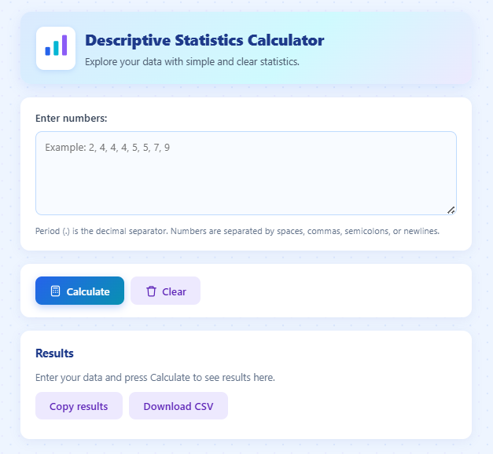

# Descriptive Statistics Calculator

A simple, interactive web calculator for exploring descriptive statistics.

   

## Overview

**Descriptive Statistics Calculator** is a lightweight, fully client-side web app that turns a raw list of numbers into a clear summary of descriptive statistics. Paste your data, press **Calculate**, and instantly see the count, sum, mean, median, mode, min, max, range, and both population and sample variance/standard deviation.

It is built for students and anyone learning statistics: it shows not only the results but also exactly how your input was parsed, and explains why some values may be `N/A`. No installation, server, or internet connection is required.

## Project Preview

- Repository: <https://github.com/HoriusHung/my-first-web>
- Runs locally in any modern browser — just open `index.html`.

## Features

- Flexible data input: separate numbers with spaces, commas, semicolons, or newlines, plus a sample-data button and live value counting.
- Computes 15 statistics: count, sum, mean, median, mode, min, max, range, Q1, Q3, IQR, population variance, population standard deviation, sample variance, sample standard deviation.
- Clear "Parsed N numbers: ..." confirmation showing exactly how your input was read.
- Sorted data view and SVG histogram + box plot visualizations.
- Friendly, specific error messages that name the offending token.
- Responsive, mobile-first layout with a clean, modern "scientific + cute" visual style.
- Export results: copy a plain-text summary or download a CSV file.
- Pure HTML/CSS/JavaScript — no frameworks, no libraries, no build step.

## Statistics / Calculations

| Statistic | Symbol | Formula / Rule |
| --- | --- | --- |
| Count | n | Number of values |
| Sum | Σx | Σ xᵢ |
| Mean | x̄ | (Σ xᵢ) / n |
| Median | — | Middle value after numeric sort; average of the two middle values when n is even |
| Mode | — | Value(s) with the highest frequency; `None` if every value appears exactly once |
| Minimum | min | Smallest value |
| Maximum | max | Largest value |
| Range | R | max − min |
| Quartile 1 | Q1 | Median of the lower half of the sorted data (median excluded when n is odd) |
| Quartile 3 | Q3 | Median of the upper half of the sorted data (median excluded when n is odd) |
| Interquartile range | IQR | Q3 − Q1 |
| Population variance | σ² | Σ (xᵢ − x̄)² / n |
| Population standard deviation | σ | √(population variance) |
| Sample variance | s² | Σ (xᵢ − x̄)² / (n − 1) |
| Sample standard deviation | s | √(sample variance) |

Notes:

- Median sorting uses a numeric comparison (`a - b`) on a copy of the data.
- When multiple modes exist, all of them are listed.
- With a single value, sample variance and sample standard deviation are undefined and shown as `N/A`.

## Technologies

- **HTML5** — page structure
- **CSS3** — responsive styling (no frameworks)
- **Vanilla JavaScript** — parsing, statistics, and UI logic

No external libraries, APIs, or dependencies.

## Project Structure

```text
my-first-web/
├── index.html   # Page markup
├── style.css    # Styles (responsive, mobile-first)
├── script.js    # Parsing, statistics, and UI logic
├── LICENSE      # MIT License
├── docs/
│   └── methodology.md  # Formulas and methodology
└── README.md
```

## Getting Started

1. Download or clone the repository.
2. Open `index.html` in any modern browser.

That's it — no installation, no build step, no server.

## How to Use

1. Enter or paste your numbers into the input box (or press **Sample data**).
2. Press **Calculate** (or **Ctrl/Cmd + Enter**) to see the parsed-input line, results, and visualizations.
3. Press **Copy results** or **Download CSV** to export, or **Clear** to reset.

## Example

Input:

```text
2, 4, 4, 4, 5, 5, 7, 9
```

Expected output:

- Parsed 8 numbers: 2, 4, 4, 4, 5, 5, 7, 9
- Count (n): 8
- Sum: 40
- Mean: 5
- Median: 4.5
- Mode: 4
- Minimum (min): 2
- Maximum (max): 9
- Range: 7
- Q1: 4
- Q3: 6
- IQR: 2
- Population variance: 4
- Population standard deviation: 2
- Sample variance: 4.571429
- Sample standard deviation: 2.13809

## Screenshot



## Input Rules

- Numbers are separated by spaces, commas, semicolons, or newlines.
- Period (`.`) is the decimal separator.
- `1,5` is read as two numbers: `1` and `5`.
- Each token must match `/^[+-]?(\d+\.?\d*|\.\d+)$/` — plain decimals only, optionally signed; forms like `.5` and `5.` are accepted.

## Output Formatting

- Up to 6 decimal places, with trailing zeros removed.
- No thousands separator.
- `-0` and values that round to zero are shown as `0`.
- Undefined values are shown as `N/A`.

## Error Handling

- Empty input → `Please enter a list of numbers.`
- Invalid token → `Invalid token: '<value>'. Only decimal numbers are allowed (period is the decimal separator).`
- Non-finite / too large number → `Invalid token: '<value>' (number too large or infinite).`

The error names the offending token. On error, the result table is hidden and the parsed-numbers line is cleared.

## Edge Cases

- Single value: mean, median, min, max, range, and population statistics are computed; sample variance and sample standard deviation show `N/A`.
- Multiple modes: all of them are listed, comma-separated.
- No mode (every value appears exactly once): mode shows `None`.
- More than 50 numbers: the `Parsed N numbers: ...` line lists the first 50 numbers followed by `...`.

## Manual Testing

Expected results:

| Input | Expected result |
| --- | --- |
| `2, 4, 4, 4, 5, 5, 7, 9` | n = 8, sum = 40, mean = 5, median = 4.5, mode = 4, min = 2, max = 9, range = 7, Q1 = 4, Q3 = 6, IQR = 2, population variance = 4, population SD = 2, sample variance = 4.571429, sample SD = 2.13809 |
| `10, 9, 2` | median = 9 |
| `1, 1, 2, 2, 3` | mode = "1, 2" |
| `1, 2, 3, 4` | median = 2.5 |
| `1,5` | "Parsed 2 numbers: 1, 5", n = 2, sum = 6, mean = 3 |
| `7` | mode = "None", population SD = 0, sample variance = N/A, sample SD = N/A |
| `1, 2, 3` | mode = "None" |
| `-0.0000001` | mean shows `0` |
| `0x10`, `Infinity`, `abc` | error naming the invalid token |
| very long digit string (e.g. 400 digits) | error: number too large or infinite |

## Documentation

See [docs/methodology.md](docs/methodology.md) for the exact formulas, parsing rules, and formatting rules used by the calculator.

## License

This project is licensed under the MIT License. See the [LICENSE](LICENSE) file for details.
